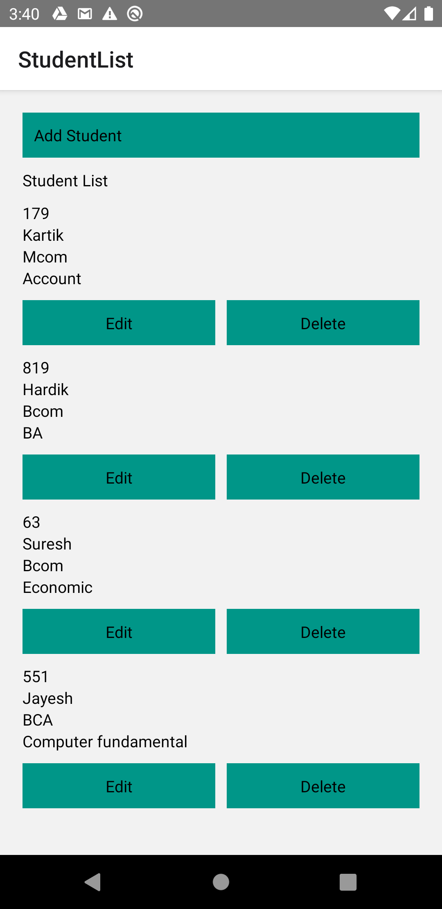
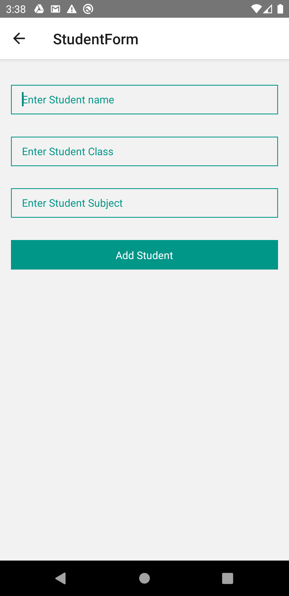
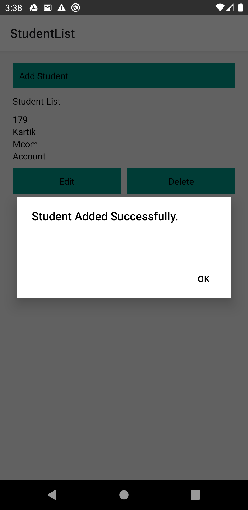
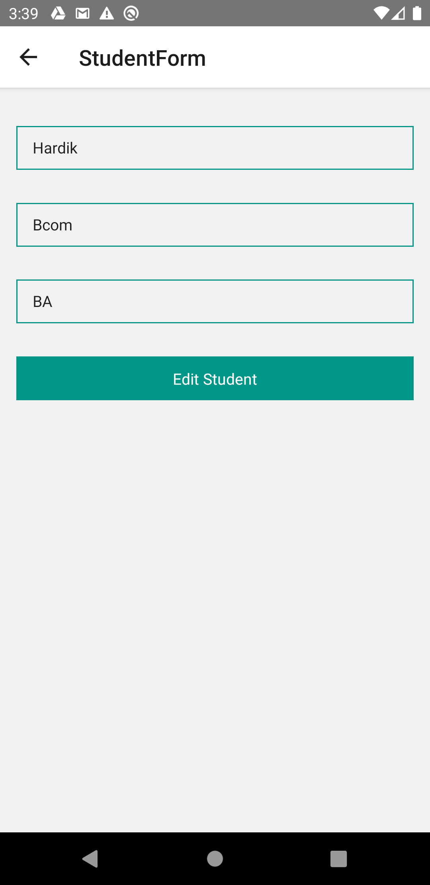

# Student_Crud_Realm
 
 How to implement CRUD operations with using Hooks and Realm
 

 In this tutorial, we'll make a simple CRUD app that can add, update, or delete student using hooks and Realm database.
 Added schema for student.
 Added common crud operation method in relam database.
  

 

    
                                         
    
                                         
     

     

                                                                                                
Running the project

 
Assuming you have all the requirements installed, you can setup and run the project by running:

yarn or npm install to install the dependencies
run the following steps for your platform

Android

only the first time you run the project
yarn or npm start to start the metro bundler, in a dedicated terminal
yarn android to run the Android application (remember to start a simulator or connect an Android phone)

IOS

cd ios pod install to install pod dependencies cd .. to come back to the root folder yarn or npm start to start the metro bundler, in a dedicated terminal yarn ios to run the iOS application (remember to start a simulator or connect an iPhone phone)
